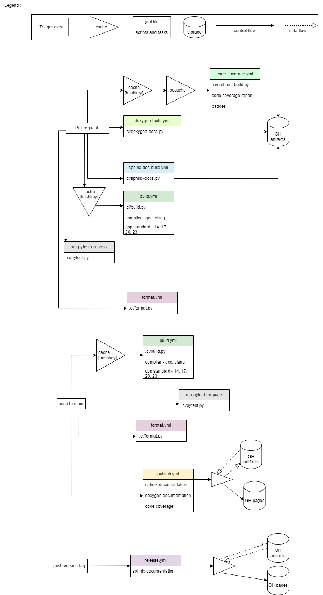

# Github Workflows

## Overview

To ensure a stable main branch, we verify PRs (Pull Requests) once they are created or updated and again when they are accepted. Therefore, each verification workflow needs to have pull_request set in the trigger conditions. Please refer to the above diagram to clearly understand the workflow of our CI.

## General guidelines

1. Don't waste compute time.
2. Each job should have a specific purpose.
3. Each artifact produced should make sense on its own.
4. Don't rely on a different job running afterwards.
5. Each job should have a unique name.

## PR Verification Process

1. Code Review: Reviewers check for code quality, functionality, and adherence to coding standards.
2. Automated Checks: The CI workflows run automated checks, including builds, tests, format_check, code coverage, and documentation generation.
3. Manual Testing: Reviewers perform manual testing if necessary to verify functionality.
4. Approval and Merge: Once the PR passes all checks and reviews, it can be approved and merged into the main branch.
5. Post-Merge Verification: Monitor the CI pipeline to ensure the merge does not introduce any issues.